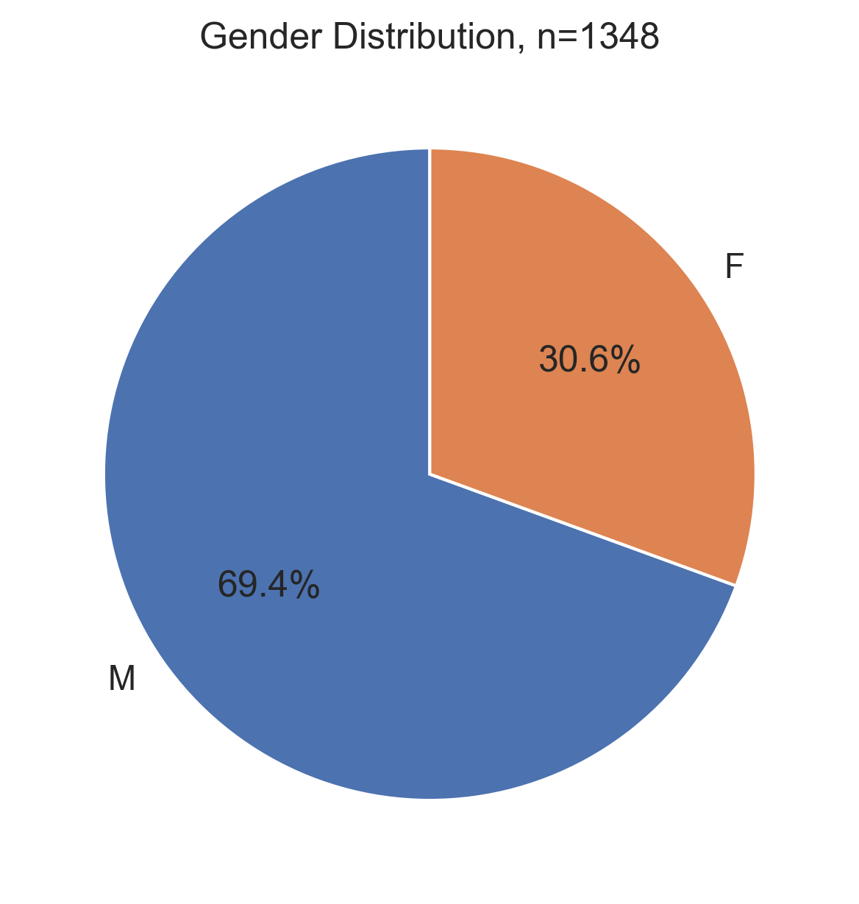
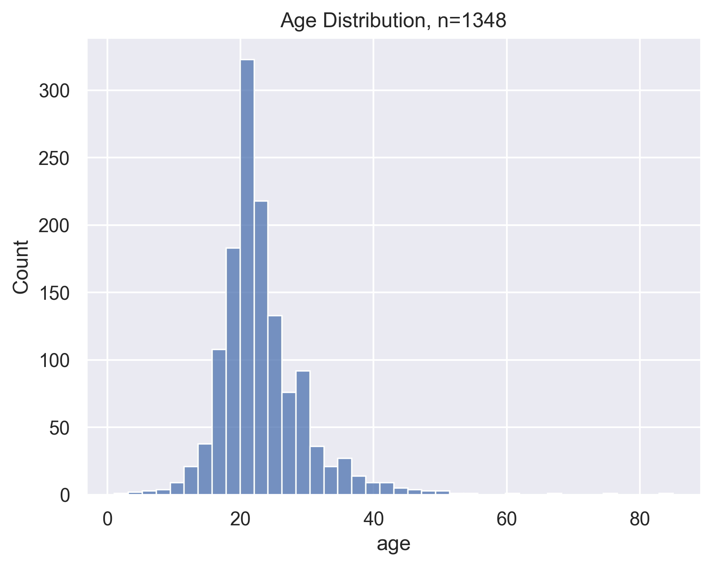
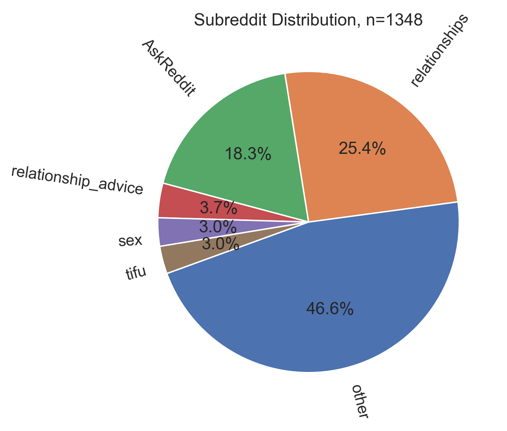
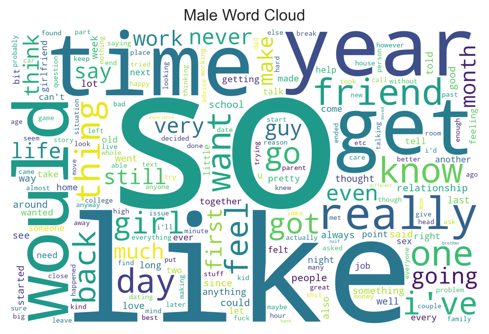
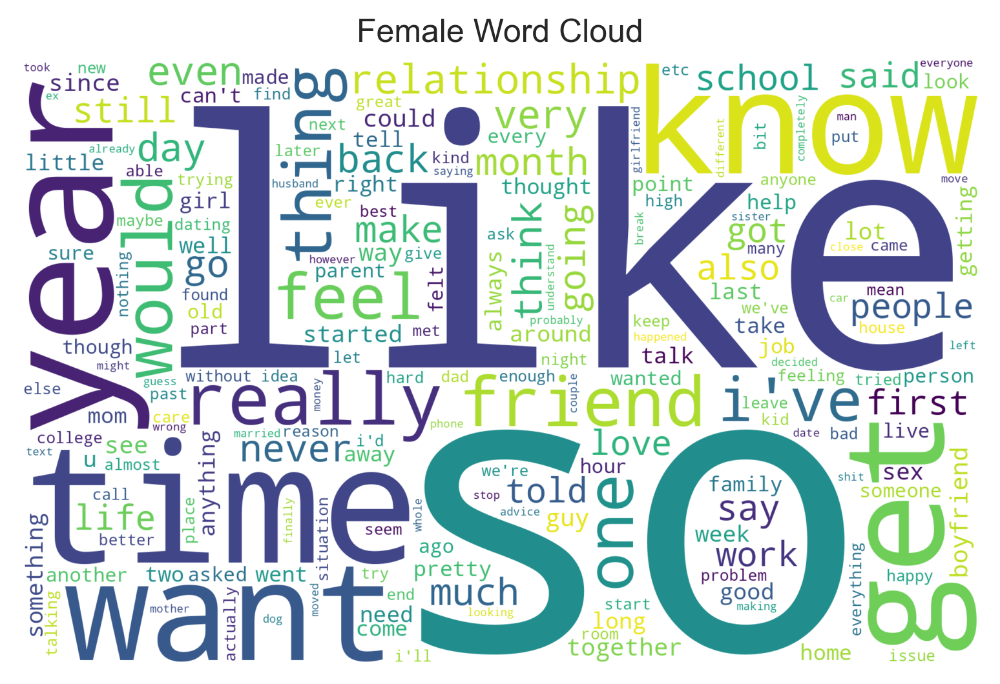

# Intensifier Use by Gender & the Gender Paradox

_Group members: Askar Bozdjan, Ema Nesic_

## Introduction

There have been many studies on the linguistic differences between the genders. Labov [1] notes that women tend to use the more prestige (socially valued) forms of language. Moreover, Argamon et. al. [2] found that women tend to use more pronouns in their writing.

In our project, we wanted to investigate the use of intensifiers among genders and whether there are any differences in their usage. The following hypothesis was formulated:
> **Is there a difference in the use of intensifiers between genders? If so, how different is it?**

_Intensifiers are words that modify adjectives and adverbs to increase their strength. For example, in the sentence "I am very happy", the word "very" is an intensifier that strengthens the adjective "happy"._

## Dataset

Webis-TLDR-17 [3] dataset was used as the base data for the project. Due to financial constraints (described below), a random subset of 50k posts was selected.

For our analysis, we needed to identify the gender of the poster. Luckily, many users in their posts define their age & gender in the form of "25M" or a variation of that with number indicating the age and letter(s) the gender of the poster.

Using this information, we have gathered ~1.3k posts out of original subset of 50k that contained age & gender data with the respective age & gender labels. **The dataset we have gathered is shared in the repository.**

## Methods


### Setup 

Create the environments and install the dependencies:
```bash
conda create --name myenv python=3.12.4
conda activate myenv
pip install -r requirements.txt
```

eda.ipynb does basic tests and creates eval csvs for manual labelling.
label_with_llm.py labels the dataset with the LLM model (Won't run without a DeepInfra API key), and saves chunks of labelled data to disk (same dir as CWD).
eda_w_gendered_ds.ipynb does the analysis on the labelled dataset.

Note that the labelled dataset is already provided. Can just run eda_w_gendered_ds.ipynb only.

### Experiments
### Preparation of the dataset with gender information
As described previously, on many posts on Reddit users specify their gender in the text. However, the text is not always in the same format. For example, some users write "25M", while others write "(m25)", [25 male]. Moreover, the mentioned age & gender is not necessarily the posters', and there can be multiple references to age & gender, referring to other people.

##### Regex approach to extracting labels
For a baseline a simple heuristic can be used: In a lot of the cases, the user specifies their age & gender firstly, before others' age & gender. We can use this fact and a simple regex to extract the labels.

The regex is as follows:
```js
'\b(\d{1,3})\s*(M|F|NB)\b'
```
It matches age and gender in the form of "25M", "25 m", "25M", "100 nB", etc.

#### Evaluation of regex approach
To evaluate how well this approach works, we have selected 100 posts randomly and applied the regex labelling approach. Then, we have manually checked the predicted labels and calculated the accuracy of the regex approach. Using the regex appraoch we got an **accuracy of 54%**. Which is not too bad considering the simplicity the approach, however it is unusable for any further analyses.

#### LLM approach to extracting labels
Due to the semantic complexity of the task, and the fact that we do not have enough manpower to label enough data on our own, we have decided to use another approach for labelling. We have used an instruct-finetuned LLM to predict the labels instead.

As we do not have enough computational resources to run Gen LLMs, we have opted for a SaaS approach. We have used Phi-3-Medium model hosted on DeepInfra. The model was chosen for the following reasons:
1) **Cost**: Only 0.14$ per 1M tokens. Compare this to GPT-4o, which costs 5$ per 1M tokens.
2) **Stability and prompt following**: Many models the size of Phi-3 either become erratic (even with low temperatures) or do not follow the prompt well. Phi-3-Medium has been tested to be stable and follow the prompt well.
3) **Fine-tuned to output json**: The model is trained to stably output JSON (and only JSON if requested). Given that we want to extract structured data from the text, it's a good fit.
4) **Non-complex problem**: Although requiring semantic understanding sometimes, it is still a relatively simple problem compared to other NLP tasks.

Overall, the model has been a good fit for our needs. We have used the model to label the dataset with. The total cost was 27M tokens used for the labelling, which amounts to 3.85$.

##### Evaluation of the LLM approach for label extraction
As with the regex approach, we have evaluated the label accuracy. Using the same posts we have used to evaluate the regex approach, we have calculated the accuracy of the LLM approach. The accuracy of the LLM approach was **91%**. This is a significant improvement over the regex approach, and we have decided to use the LLM approach for the rest of the project. Although still noisy, the labels are good enough for our purposes.

### Statistical measures
Chi-square test is a statistical test used to determine whether there is the observed difference between the expected frequencies of the observed data. In our case, we have used the chi-square test to determine whether there is a significant difference in the use of intensifiers between the genders. The null hypothesis is that there is no difference in the use of intensifiers between men and women's use of intensifiers.
Moreover, we have looked at the percentage of intensifiers used by gender.

## Results and Discussion

### Resultant dataset statistics

#### Gender distribution


#### Age distribution


#### Subreddit distribution


#### Male Wordcloud



#### Female Wordcloud



### Intensifier Analysis
The results are inconclusive, the dataset is small and the labels are noisy, so the results should be taken with a grain of salt, especially the chi-square p-values.

_Note: To keep the experiments in-scope, we have only used the intensifiers "so", "pretty", "very" and "really" in our analysis._

Chi-square test results for the intensifiers are as follows:

| **intensifier** | **p-value** |
|:---------------:|:-----------:|
|        so       |    **0.028**    |
|      really     |    0.249    |
|       very      |  **0.0000255**  |
|      pretty     |    0.842    |


The percentage of intensifiers used:


| intensifier | M    | F    |
|-------------|------|------|
| so          | 1.43%| 1.54%|
| really      | 0.6% | 0.73%|
| very        | 0.3% | 0.48%|
| pretty      | 0.2% | 0.23%|

To see further possible differences, we have also looked at the bigram frequencies by gender.

### Bigram Frequencies (Male)

| Bigram       | Frequency |
|--------------|-----------|
| feel like    | 0.2%      |
| high school  | 0.1%      |
| year old     | 0.08%     |
| first time   | 0.06%     |
| so much      | 0.06%     |
| even though  | 0.06%     |
| years old    | 0.05%     |
| one day      | 0.05%     |
| felt like    | 0.05%     |
| pretty much  | 0.05%     |

### Bigram Frequencies (Female)

| Bigram       | Frequency |
|--------------|-----------|
| feel like    | 0.2%      |
| high school  | 0.1%      |
| so much      | 0.09%     |
| even though  | 0.07%     |
| year old     | 0.05%     |
| last year    | 0.05%     |
| pretty much  | 0.05%     |
| first time   | 0.05%     |
| months ago   | 0.05%     |
| started dating | 0.04%   |


## Conclusion

Although chi-square test results indicate that there is a significant difference in the use of "so" and "very" intensifiers, the results should be taken with caution due to the small dataset and noisy labels. 

With more data and cleaner labels, we could potentially find more significant differences in the use of the intensifiers.

## Contributions

| Team Member  | Contributions                                             |
|--------------|-----------------------------------------------------------|
| Ema Nesic  | "Brains": Theory, ideas, hypothesis building, evaluating the results on a linguistic level|                                                       |
| Askar Bozdjan | "Brawns": Labelling, preprocessing, generating the figures & statistical measure                                                       |

## References


[1]  Labov, William (2001). Principles of Linguistic Change, Vol. 2: Social Factors. Malden, MA: Blackwell Publishers Inc. pp. 261 - 293.

[2] Argamon, S., Koppel, M., Fine, J., & Shimoni, A. R. (2003). Gender, genre, and writing style in formal written texts. Text, 23(3), 321-346. https://doi.org/10.1515/text.2003.014

[3] https://webis.de/data/webis-tldr-17.html